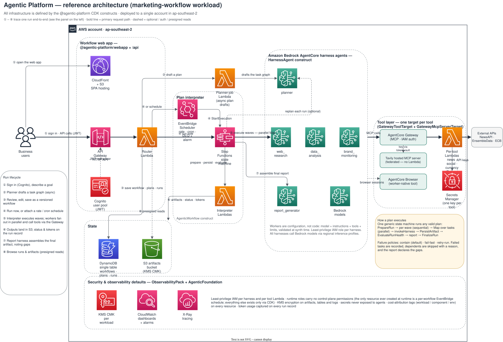

# Agentic Workflow Platform

A reusable AWS platform for building, running, and operating multi-agent AI workflows. Describe a goal in plain language, review the plan an AI planner drafts, save it as a versioned workflow, then run it on demand or on a schedule — and read the report it produces.

Built entirely from configuration over AWS CDK constructs: Amazon Bedrock AgentCore harness agents, a Step Functions plan interpreter, and a serverless web app. Standing up a brand-new agentic workload is a matter of writing agent configs, not platform code.

> **Disclaimer — reference implementation.** This repository is provided for
> reference and evaluation purposes and is not production-ready as-is.
> Before any production use, review and address the findings in the
> [Well-Architected review](docs/well-architected-review.md) — in
> particular the severity-ranked *before-production shortlist* (WAF and
> API throttling, prompt-injection guardrails, CI/CD, cost ceilings, and
> DR posture).

## What you get

| Layer | What it does |
|---|---|
| Foundation CDK library | Typed, secure-by-default constructs that provision everything an agentic workload needs: agents, workflow engine, storage, scheduling, observability |
| Planner-driven workflows | A goal becomes a structured task graph; one shared Step Functions state machine executes any plan with parallel fan-out, failure containment, and a final report step |
| Workflow web app | Sign in, create workflows from goals, review and edit plans, manage schedules, watch runs, browse artifacts, tune agents at runtime |
| Reference workload | A complete marketing-intelligence agent team for a fictional wine & beverages company — nine agents defined in one YAML file (`examples/marketing-workflow`) |

## Architecture



### How a run works

1. A signed-in user submits a goal. The planner harness drafts a task graph.
2. The user reviews and edits the draft — per task: prompt, worker, allowed tools, and model — then saves it as a versioned workflow.
3. A run starts via "run now" or a schedule. Both start the same Step Functions state machine.
4. The interpreter executes the plan in dependency waves; independent tasks fan out in parallel straight to worker harnesses.
5. Workers call tools through the AgentCore Gateway (MCP); API keys stay in Secrets Manager, never visible to agents.
6. Every task output is persisted to S3 with a task record (status, timing, token usage) in DynamoDB.
7. A report harness assembles all task outputs into the final artifact. Failed tasks are recorded, their dependents skipped with a reason, and the report notes the gaps — partial results beat total failure.

Plans are data, not infrastructure: agents are YAML entries, tools are gateway targets, and a new workload is one CDK construct call. The [technical guide](docs/technical-guide.md) covers how each piece works.

## Quick start

### Prerequisites

- Node.js >= 20 and npm
- AWS credentials for the target account, and the CDK bootstrapped in your target region (`npx cdk bootstrap`)
- **Amazon Bedrock AgentCore** available in your target region — check [AgentCore region availability](https://docs.aws.amazon.com/general/latest/gr/bedrock_agentcore.html)
- Amazon Bedrock **model access** enabled in that region, and the inference profile ID you intend to use. The platform never guesses a model — you pass it explicitly:
  ```bash
  aws bedrock list-inference-profiles --region <region> \
    --query "inferenceProfileSummaries[].inferenceProfileId"
  ```

> **A note on regions.** The sample defaults to **ap-southeast-2**. To
> deploy elsewhere, pass `-c region=<region>` on every cdk command, use
> region-appropriate inference profile ids (`us.…` vs `au.…`), and create
> the secrets below in that region. (The flag exists because the CDK CLI
> overwrites `CDK_DEFAULT_REGION` — see decision D-28.)

### 1. Create the tool API key secrets

Store keys in Secrets Manager (same region as the deployment). Only the Tavily key is **required before deploy**; the rest are optional — missing keys degrade gracefully (agents fall back to labeled "(synthesis)" content and reports declare the coverage gaps).

| Secret | Provider | Register |
|---|---|---|
| `marketing-workflow/tavily-api-key` (required) | Tavily | https://app.tavily.com/ |
| `marketing-workflow/newsapi-api-key` | NewsAPI.org | https://newsapi.org/register |
| `marketing-workflow/ensembledata-api-key` | EnsembleData (TikTok/IG/YT/Threads) | https://dashboard.ensembledata.com/register |

```bash
aws secretsmanager create-secret \
  --name marketing-workflow/tavily-api-key \
  --secret-string '<your-key>' \
  --region ap-southeast-2
```

> **Third-party services.** These integrations are optional and call each
> provider's public API with keys you supply — no provider code or data
> ships in this repository, and AWS is not affiliated with or endorsing
> these providers. Your use of each service is governed by that provider's
> own terms (note: NewsAPI's free tier is development-only, and social
> data returned by EnsembleData is subject to the source platforms'
> terms). The keyless `currency_rates` tool uses frankfurter.dev (ECB
> reference rates).

### 2. Build and deploy

```bash
npm install
npm run build
cd examples/marketing-workflow
npx cdk deploy -c modelId=<inference-profile-id> -c removalPolicy=destroy
```

Useful context flags:

- `-c removalPolicy=destroy` — **recommended for trials**: lets `cdk destroy` remove stateful resources later. Omit for production-like deployments.
- `-c deepModelId=<id>` — optional but recommended: adds a deep-tier model for the planner and per-task assignment.
- `-c fastModelId=<id>` — optional: adds a cheap tier to the per-task model menu.

The deploy prints the outputs you need — web app URL, user pool id, API URL. List them anytime:

```bash
aws cloudformation describe-stacks --stack-name MarketingWorkflow \
  --query "Stacks[0].Outputs" --output table
```

### 3. Create a user

Self-sign-up is disabled by design:

```bash
aws cognito-idp admin-create-user --user-pool-id <UserPoolId> \
  --username <name> --temporary-password '<TempPassw0rd!>'
# Optional: administrators (edit agent prompts/models, org settings, any workflow)
aws cognito-idp admin-add-user-to-group --user-pool-id <UserPoolId> \
  --username <name> --group-name admin
```

### 4. Run your first workflow

The reference workload is a **marketing-intelligence agent team** for a fictional wine & beverages company: a planner, a portfolio expert, four research workers, a quantitative analyst, a campaign strategist, and a report writer — all nine defined in `examples/marketing-workflow/workload.yaml`. (The `product_expert` agent ships with a starter brief about the fictional portfolio; edit its prompt in Settings to match your own domain.)

Open the `WebAppUrl` output, sign in, and create a workflow with a goal like:

> *"Plan a spring campaign for our sparkling-wine brand in the Australian market: brand profile and target segment, current consumer sentiment, competitor activity, and social-channel compliance constraints. Deliver a campaign strategy."*

Review the drafted plan, save, hit "run now", and watch per-task status, timing, and token usage on the run detail page. The report lands in the artifact browser. Attach a rate/cron schedule to make it recurring.

Full screenshot walkthrough: [`docs/webapp.md`](docs/webapp.md).

## What it costs

The stack is serverless, so an idle deployment costs little: the KMS key (about $1/month), CloudWatch dashboard (about $3/month), and cents of storage. The real cost is per run — **Bedrock model tokens** across the planner, the parallel workers, and the report writer, plus any paid tool APIs. Token usage is tracked per task and per run in the app. Scheduled workflows keep running until disabled — check the schedule toggle before walking away from a trial.

## Clean up

```bash
cd examples/marketing-workflow
npx cdk destroy -c modelId=<your-inference-profile-id>
```

If you deployed with `-c removalPolicy=destroy`, this removes everything, including the table, buckets, and key. With the `RETAIN` default, the stateful resources (KMS key, DynamoDB table, S3 buckets) survive the destroy and must be deleted manually.

## Going further

| I want to... | Read |
|---|---|
| Understand the architecture, planner, agent manifest, and tool layer in depth | [`docs/technical-guide.md`](docs/technical-guide.md) |
| See the web app end to end with screenshots | [`docs/webapp.md`](docs/webapp.md) |
| Add or edit an agent | [`docs/new-agent-in-a-day.md`](docs/new-agent-in-a-day.md) and the [technical guide](docs/technical-guide.md#edit-or-add-workers) |
| Add a tool, or build my own workload | [technical guide](docs/technical-guide.md#add-a-tool) |
| Use Python for agents, tools, and backend APIs | [`docs/python-developers.md`](docs/python-developers.md) |
| Assess production readiness (security, DR, cost controls) | [`docs/well-architected-review.md`](docs/well-architected-review.md) |
| See why things are built this way (live-verified service behaviors) | [`docs/decisions.md`](docs/decisions.md) |
| Score report quality | [`evals/report-quality-rubric.md`](evals/report-quality-rubric.md) |

## Current scope and limitations (v1)

- Single account, single region per deployment
- Run status updates by polling (≤5 s); no WebSocket push
- Plan review is a structured form, not a visual DAG editor
- Access control: authenticated users plus an `admin` group (no finer-grained RBAC)
- Per-task `allowedTools` is enforced at validation/prompt level; service-side runtime enforcement is on the roadmap
- For the full list and production-readiness findings, see the [Well-Architected review](docs/well-architected-review.md)

## Contributing

See [CONTRIBUTING.md](CONTRIBUTING.md) for how to report issues and submit changes.

## Security

If you discover a potential security issue in this project we ask that you notify AWS/Amazon Security via our [vulnerability reporting page](http://aws.amazon.com/security/vulnerability-reporting/). Please do **not** create a public GitHub issue.

## License

This project is licensed under the MIT-0 License. See the [LICENSE](LICENSE) file.
