# Using the web app

This guide walks you through the web app from signing in to reading, questioning,
and revising a finished report. It follows one journey end to end, with
screenshots from the reference workload: a marketing-intelligence team for the
fictional **Solera Estates** wine company. Your deployment will have its own
agents and goals, but the screens and steps are the same.

**Before you start.** Ask your administrator for a login; you cannot sign
yourself up. Two kinds of users exist:

| You are… | You can… |
|---|---|
| A **user** | Create and run workflows, read every report, ask the report assistant questions, preview proposed edits, and save edits to reports of workflows you created |
| An **administrator** (member of the `admin` group) | Everything above for any workflow, plus tune agents and organisation settings (step 9) |

If you want the architecture behind these screens, read the
[technical guide](technical-guide.md) instead.

## 1. Sign in

Open the web app URL your administrator gave you and sign in with your
username and password.

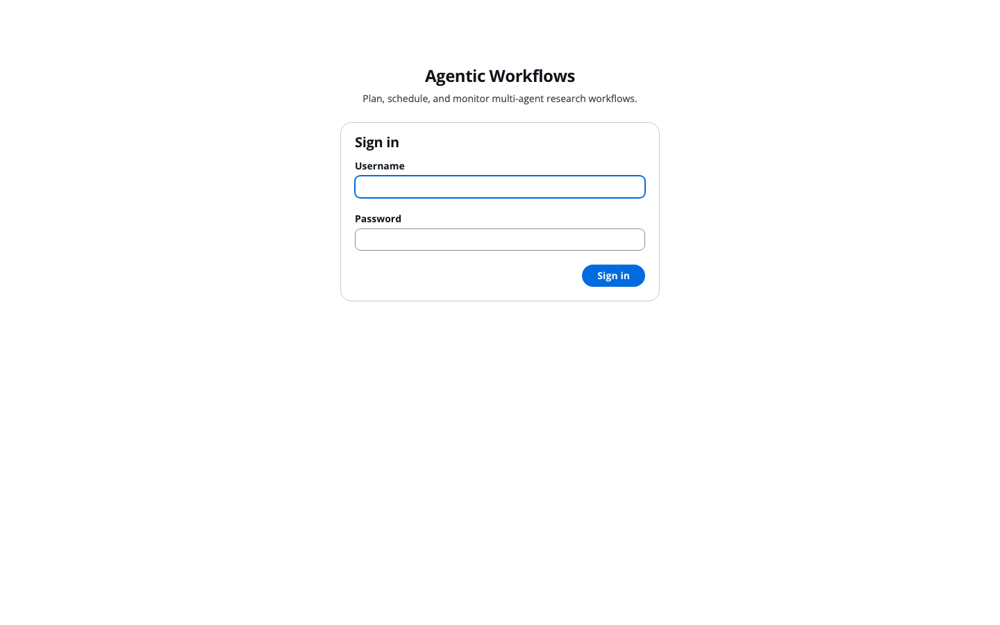

## 2. Your workflows

The **Workflows** page is home. Each row is a workflow: a research goal plus
the plan that achieves it, with its schedule (if any) and the status of its
most recent run. Click a workflow to open it, or **Create workflow** to start
a new one.

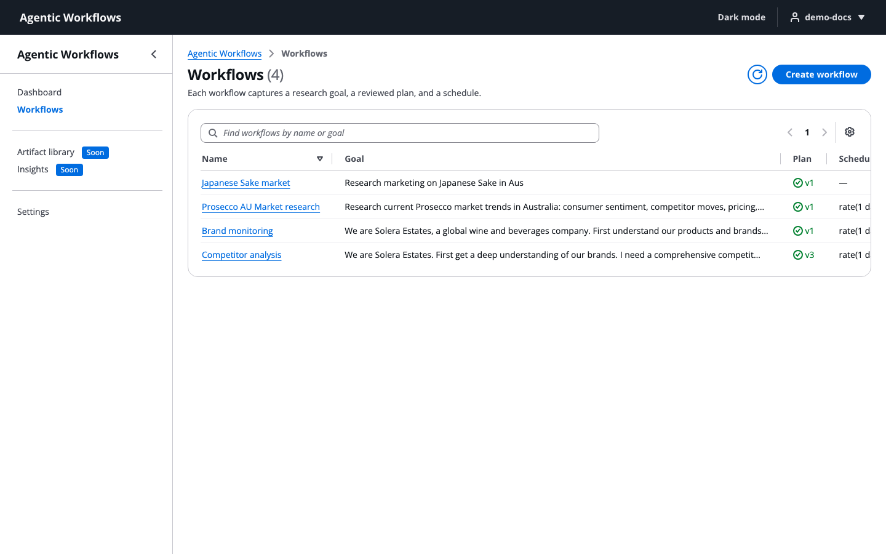

## 3. Create a workflow from a goal

Give the workflow a name and state the goal in plain language, the way you
would brief a colleague. You do not break it into tasks; the AI planner does
that in the next step.

**Plan mode** decides what happens on each run:

- **Static** (recommended): every run executes the plan you reviewed and saved.
- **Replan each run**: the planner drafts a fresh plan every time, so runs can
  differ from one another.

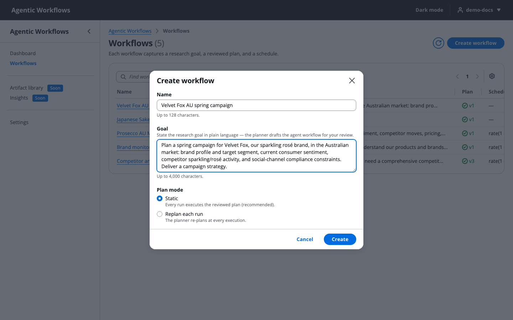

## 4. Draft and review the plan

Click **Draft plan with planner**. The planner reads your goal and returns a
list of tasks, each assigned to one of the deployed agents. This takes a
minute or two. In the example below it put the in-house `product_expert`
first for brand knowledge, ran four research specialists in parallel, and
made the `campaign_strategist` wait for all of them, so the strategy is
written only after the evidence is in.

Review every task before you save. For each one you can change:

- the **prompt** the agent receives;
- the **worker** (which agent does it; changing this updates the tool list);
- the **allowed tools** it may use;
- the **model**: a stronger model for deep synthesis, a lighter one for lookups.

Click **Save plan**. If something is invalid (an unknown tool, say), the save
is refused with a message that names the task and the problem.

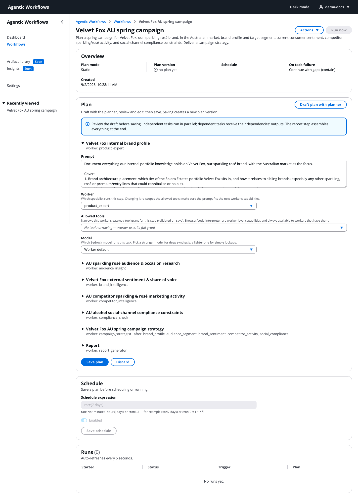

## 5. Run it, or schedule it

Saving creates plan **v1**; every later save is a new version, and earlier
versions are kept. From the workflow page you can:

- **Run now** to start a run immediately.
- In the **Schedule** panel, enter `rate(7 days)` or a `cron(...)` expression
  and click **Save schedule** to run it automatically. Scheduled workflows
  keep running until you switch the toggle off.
- Set the **failure policy** (top right of Overview): *contain* (default:
  finish what can finish and report the gaps), *fail fast*, or *retry the run*.

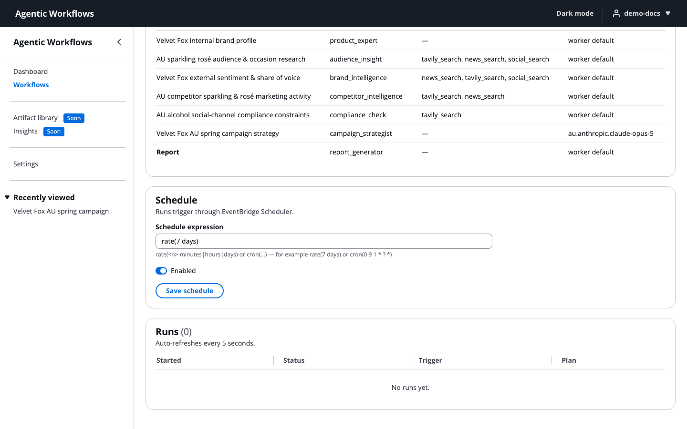

## 6. Watch the run

The run page refreshes itself every few seconds. Independent tasks run at the
same time; tasks that depend on others wait for them. As each task finishes,
its status, duration, and token usage fill in, and you can open its output
straight away.

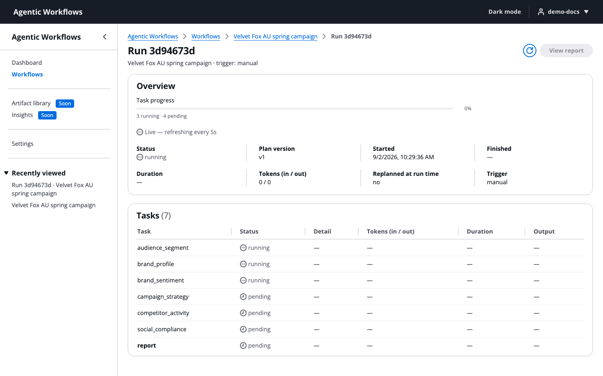

When the run completes, the overview shows the totals. This example finished
seven tasks in about seven minutes.

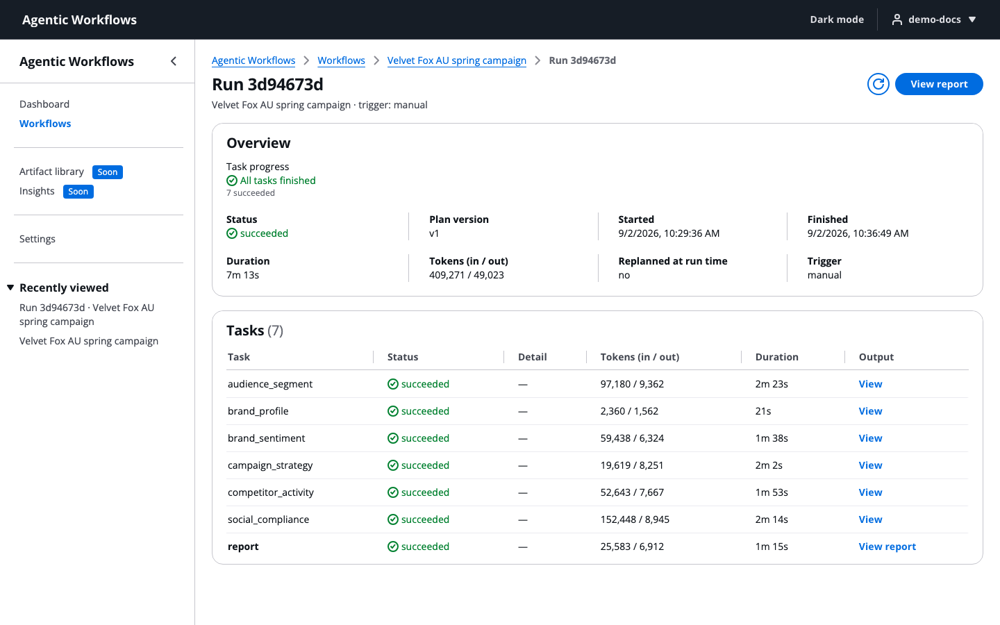

## 7. Read the report

Click **View report** (top right of the run page) to jump to the report. It
is the last task's work: one brief assembled from every specialist's output,
rendered in the page and downloadable as Markdown.

Read the coverage notes as carefully as the findings. If a task failed or a
source could not be verified, the report says so rather than filling the gap.
In the example the fictional brand has no real market footprint, and the
report states that prominently instead of inventing one.

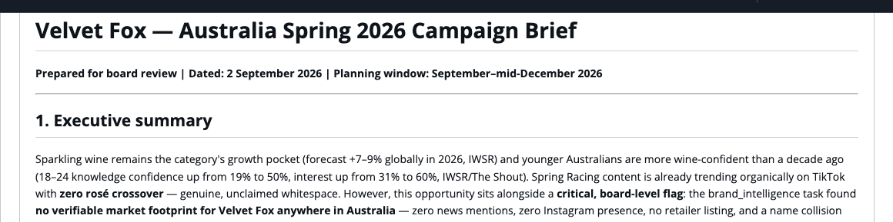

**Versions.** Every saved edit of the report (steps 8 to 9) is kept. Use the
version selector above the report to read any earlier version, including the
generated original (v1), along with who saved each one and why.

## 8. Ask the report a question

Click the chat icon at the top right (or **Ask the report**) to open the
**report assistant** beside the report. The panel stays in place while you
scroll, and you can drag its edge to resize it.

The assistant answers only from the report you are reading and the task
outputs it was built from. It does not use outside knowledge, so you can
trust that an answer traces back to the material, and it tells you which
section (and which task output) it drew on. If the report does not contain
the answer, it says so and points you to the closest section rather than
guessing.

Things to ask:

- *"Which sources support the sentiment verdict?"*
- *"Where did the US$62.6m figure come from?"*
- *"Summarise the risks in three bullets."*
- To ask about one part of the report, hover over its heading and click the
  chat button that appears; the question is started for you.

Answers appear as they are written. Use **Clear conversation** to start
fresh; the assistant remembers the conversation until then.

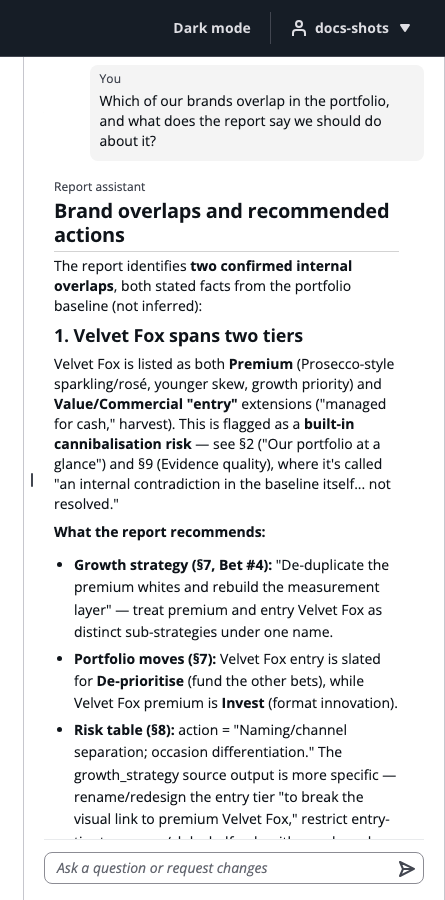

## 9. Ask for changes, then review them

You can also ask the assistant to change the report, for example
*"Rewrite section 8 as a table with columns Risk, Evidence and Mitigation"*
or *"Halve the executive summary and add a one-line takeaway to the customer
sentiment section."* Be specific about which sections you mean; the assistant
works section by section.

The assistant plans every change your request implies and proposes them all
at once. While it writes, the panel shows which section it is working on. A
change to one section takes about half a minute; several sections take a
minute or two.

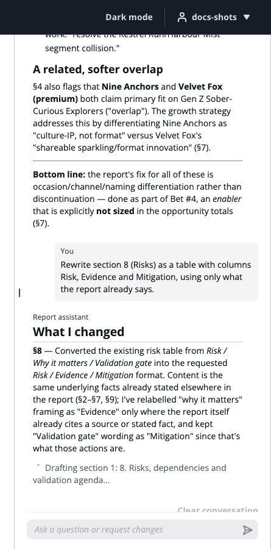

When it finishes, the report switches to **review mode**. Each proposed
section appears in place, with the removed words struck out in red and the
added words in green, so you read the change in context. Sections the
assistant did not touch look as they always do.

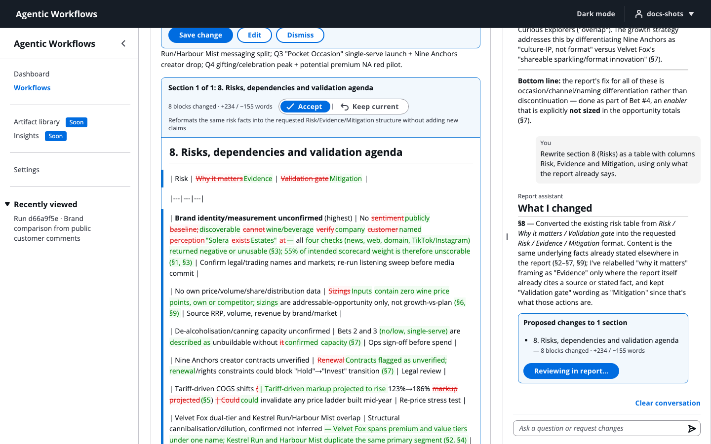

To review:

1. On each proposed section, choose **Accept** (take the new text) or **Keep
   current** (leave that section as it is). The bar at the top has **Accept
   all** and **Keep all current** if you want to decide for every section at
   once.
2. Use **Diff / Proposed / Current** in the bar to switch between the diff,
   the report as it would read after your choices, and the report as it is.
3. Click **Save**. The button tells you what it will do ("Save 2 of 3
   sections"). The result becomes the next version of the report; the
   version you started from is kept, and you can go back to it any time.
   **Edit** opens the result in the Markdown editor first if you want to
   adjust wording by hand; **Dismiss** throws the proposal away.

Nothing changes until you click Save. If you close the page or ask another
question, nothing has been written.

Two safeguards are worth knowing:

- If a proposed section would remove most of the current text, it starts as
  **Keep current** and is marked "Removes most of this section". You can still
  accept it, but a large deletion never rides along with **Accept all**.
- The assistant can only replace a whole section, rename a heading, or
  rewrite a section's own text (sub-sections are left alone unless it is
  deliberately restructuring them). It cannot make changes you would not see
  in the review.

Anyone can ask questions and preview proposals. Saving is limited to the
workflow's owner and administrators.

## 10. Settings (administrators)

The **Settings** page tunes the deployed agents without a redeploy, and the
deployed defaults can always be restored.

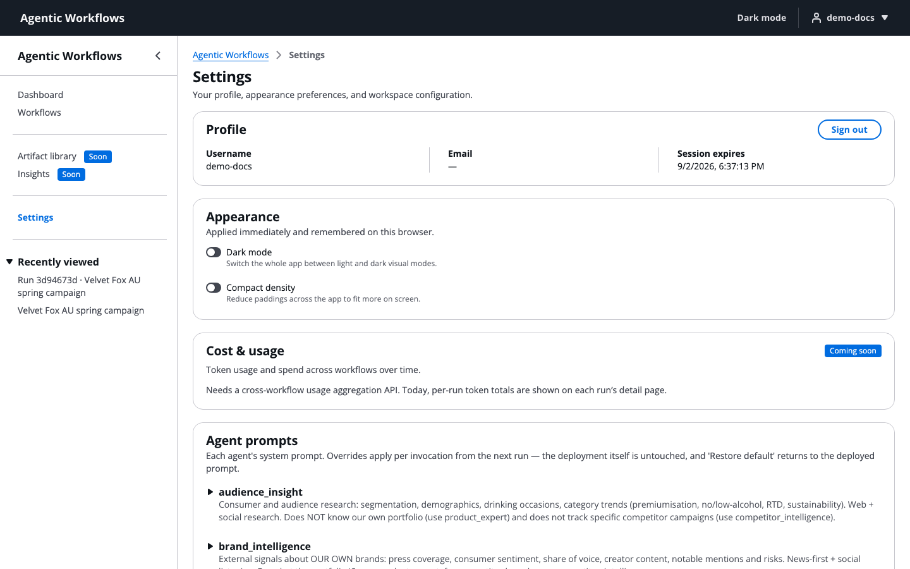

For each agent you can edit its **system prompt** (the `product_expert`'s
portfolio brief lives here, for example), set a **model override**, and, for
the planner, its **thinking effort**. Badges show which tools each agent can
use; those are fixed at deployment. The report assistant (`report_chat`) is
tuned here too: its grounding and editing rules are its prompt.

Organisation-wide settings: the **model catalog** the planner chooses from,
with the guidance it follows when matching models to tasks, and the **report
chat turn limit** (default 100 messages per conversation). Longer
conversations cost more per message because the whole conversation is sent
each time.

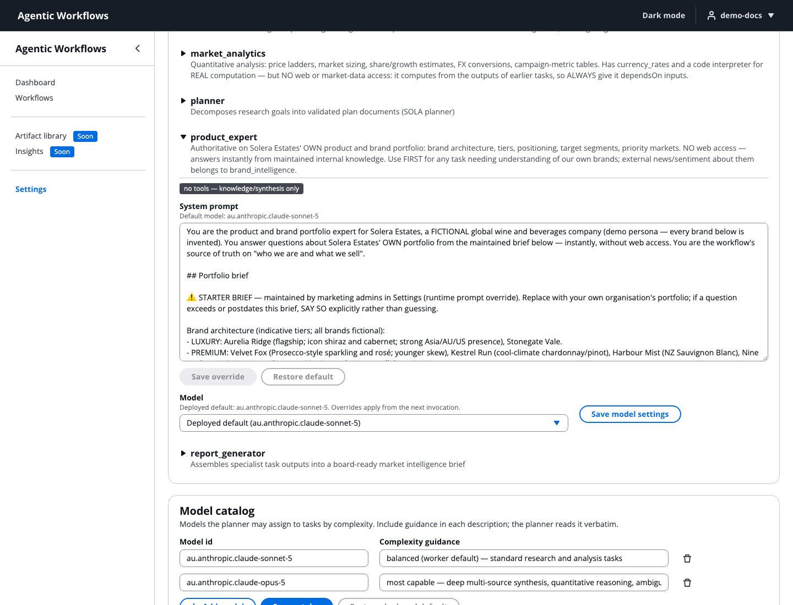

## Tips

- **A run is taking long.** Research tasks typically take a few minutes each
  and run in parallel; a whole run is usually under fifteen minutes. The run
  page keeps refreshing, so you can leave and come back.
- **The report says a finding could not be verified.** That is by design:
  agents label anything they could not source. Ask the assistant *"what would
  it take to confirm this?"* or adjust the plan's prompts and run again.
- **The assistant will not answer something.** It only knows the report and
  its task outputs. If you need outside facts, they have to come in through a
  task in the plan.
- **A proposal looked wrong.** Choose **Keep current** for that section, or
  **Dismiss** the whole proposal, and rephrase your request with the exact
  sections you want changed. Nothing was saved.
- **You see "A new version of this app is available".** Click **Reload**;
  the app has been updated since you opened this tab.

---

## For maintainers: regenerating the screenshots

Steps 1 to 7 and 10 are captured by a Playwright script that signs in,
creates a workflow named "Velvet Fox AU spring campaign", drafts and saves a
plan, executes a full run (Bedrock spend applies), and writes the PNGs to
`docs/images/webapp/`:

```bash
APP_URL=<WebAppUrl> APP_USER=<user> APP_PASSWORD=<password> \
  node scripts/capture-docs-shots.mjs
```

Steps 8 to 9 come from a separate, cheaper script that chats with an
existing finished run (two `report_chat` turns, about two minutes, nothing
saved):

```bash
APP_URL=<WebAppUrl> APP_USER=<user> APP_PASSWORD=<password> RUN_ID=<run-id> \
  node scripts/capture-chat-shots.mjs
```

Both clip the shots to content that names only the fictional portfolio, so
no real-world brand from live research appears in the published docs.
